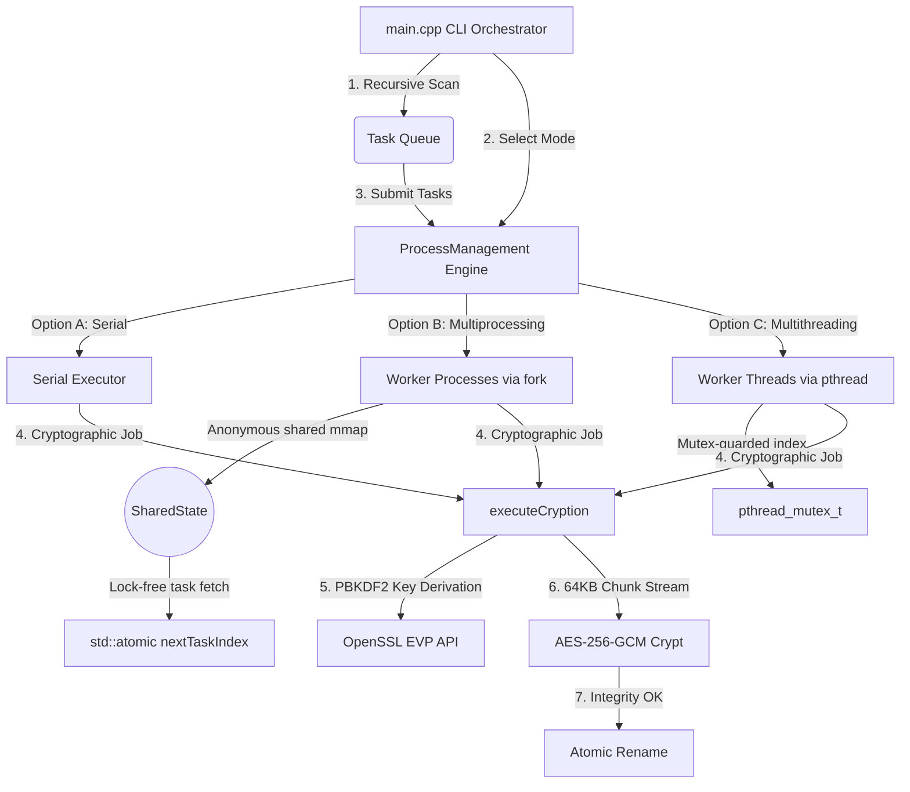

# Encryptoni — Parallel Cryptographic File Encryption Engine

Encryptoni is a high-performance C++ cryptographic engine designed for secure, concurrent encryption and decryption of directories and files. Leveraging OpenSSL 3.x's industry-standard cryptographic primitives and utilizing dual concurrency models (multiprocessing via `fork` and shared memory, and multithreading via POSIX threads), Encryptoni achieves exceptional throughput scaling across multi-core systems.

---

## Key Features

- **Authenticated Encryption**: Uses **AES-256-GCM** (Galois/Counter Mode) to ensure both confidentiality and integrity of file data.
- **Robust Key Derivation**: Implements **PBKDF2** (100,000 iterations of HMAC-SHA-256) to derive high-entropy keys from user passphrases.
- **Chunked Streaming I/O**: Streams files in **64KB chunks**, allowing processing of extremely large files (1GB+) with minimal and stable RAM consumption.
- **Three Concurrency Modes**:
  - **Serial**: Sequential, single-threaded processing for debugging or single-core execution.
  - **Multiprocessing (`fork`)**: Spawns worker processes using `fork()`. Coordinates state (task distribution, success/failure counts) via an anonymous shared memory segment (`mmap` with `MAP_SHARED | MAP_ANONYMOUS`) containing lock-free atomic counters.
  - **Multithreading (`thread`)**: Spawns POSIX threads (`pthread_create`) utilizing mutex-guarded task indices to schedule work.
- **Atomic Operations & Error Recovery**:
  - Writes outputs to temporary files (`.tmp_enc` or `.tmp_dec`) and performs atomic renames upon successful completion. This guarantees zero data loss or partial writes if the process is interrupted.
  - If a file's integrity check fails (wrong password or corrupted ciphertext), the temporary file is deleted, ensuring no unauthenticated data remains.

---

## File Format Specification

When a file is encrypted by Encryptoni, it is prefixed with a **44-byte binary header**:

```
+-------------------+-----------------+------------------+-----------------------------+
| Salt (16 bytes)   | IV (12 bytes)   | Tag (16 bytes)   | Ciphertext (Remaining data) |
+-------------------+-----------------+------------------+-----------------------------+
```

1. **Salt (16 bytes)**: Generated using a cryptographically secure random number generator (`RAND_bytes`), used for PBKDF2 key derivation.
2. **Initialization Vector (IV) (12 bytes)**: Cryptographically secure random IV for AES-GCM.
3. **Authentication Tag (16 bytes)**: Generated by AES-256-GCM to verify the integrity and authenticity of the payload.
4. **Ciphertext**: The actual file content encrypted in GCM mode.

---

## Design Architecture

Encryptoni utilizes a modular, pipelined architecture to coordinate task creation, queue management, process/thread scheduling, and file processing:



### Architectural Components

1. **CLI Orchestrator (`main.cpp`)**:
   - Parses the target directory.
   - Filters out hidden files, system files, and binaries.
   - Populates the thread-safe/process-safe queue.
2. **Concurrency Manager (`ProcessManagement`)**:
   - Coordinates scheduling.
   - Spawns and synchronizes worker threads/processes based on the execution mode.
   - Maps and initializes the shared memory segment (`SharedState`) for inter-process communication (IPC) in `fork` mode.
3. **Task Definition (`Task`)**:
   - Encapsulates metadata (file path, action) and serializes/deserializes task information into a comma-separated format.
4. **Cryptographic Core (`Cryption`)**:
   - Interacts with OpenSSL libcrypto EVP APIs.
   - Uses GCM authenticated encryption and PBKDF2 key stretching.
   - Performs atomic file rename operations to prevent partial file writes.

---

## Directory Structure

```
encryptoni-main/
├── README.md                 # Project Overview & Usage Documentation
├── walkthrough.md            # Detailed Walkthrough of Recent Implementations & Benchmarks
└── encryptoni/
    ├── Makefile              # Builds encrypt_decrypt and cryption targets
    ├── main.cpp              # Interactive entry point & directory crawler
    ├── benchmark.sh          # Performance benchmarking utility
    ├── .env                  # Configuration file containing the passphrase
    └── src/
        └── app/
            ├── encryptDecrypt/
            │   ├── Cryption.hpp     # Crypto declarations (encryptFile, decryptFile, executeCryption)
            │   ├── Cryption.cpp     # OpenSSL AES-GCM, PBKDF2, and file streaming logic
            │   └── CryptionMain.cpp # CLI wrapper around executeCryption for single tasks
            ├── fileHandling/
            │   ├── IO.hpp           # Low-level file stream loader
            │   ├── IO.cpp
            │   └── ReadEnv.cpp      # Env file loader class (retrieves passphrase)
            └── processes/
                ├── Task.hpp         # Serialized unit of work (metadata representation)
                ├── ProcessManagement.hpp
                └── ProcessManagement.cpp # Parallel orchestration engine (Serial/Fork/Thread)
```

---

## Prerequisites

- **OS**: macOS or Linux.
- **Compiler**: A C++17 compatible compiler (e.g., GCC or Clang).
- **Library Dependency**: OpenSSL 3.x.
  - On macOS, install OpenSSL via Homebrew:
    ```bash
    brew install openssl@3
    ```
  - The `Makefile` automatically detects Homebrew's OpenSSL prefix.

---

## Installation & Compilation

Navigate into the `encryptoni` directory and build the targets:

```bash
cd encryptoni
make
```

This compiles two binaries:
1. `encrypt_decrypt`: The main multi-mode orchestrator.
2. `cryption`: A standalone command-line tool to process a single task passed as a serialized string.

To clean the build artifacts:
```bash
make clean
```

---

## Usage

### 1. Set the Passphrase
Before running, create a `.env` file in the directory where you execute the binary and add your password/passphrase:
```text
my_secure_passphrase_here
```
*(Ensure there are no leading or trailing spaces/newlines unless intended, though the loader trims them automatically).*

### 2. Run the Main Engine
Execute the `encrypt_decrypt` binary:
```bash
./encrypt_decrypt
```
The program will guide you through interactive prompts:
1. **Enter the directory path**: Provide the path to the directory containing files to encrypt/decrypt (e.g., `test` or a custom folder).
2. **Enter the action (encrypt/decrypt)**: Choose `encrypt` or `decrypt`.
3. **Enter the execution mode (serial/fork/thread)**: Select your concurrency model.

### 3. Standalone Utility (`cryption`)
You can process single task strings manually using `cryption`:
```bash
./cryption "filePath,ENCRYPT"
# or
./cryption "filePath,DECRYPT"
```

---

## Benchmarks & Performance Analysis

Encryptoni includes an automated benchmarking script (`benchmark.sh`) which generates a **1 GB test suite** (200 files of 5MB each) and measures execution times across the three modes.

### Sample Execution Results (Mac mini M2 Pro)
```
=== Speedup Summary ===
Multiprocessing Speedup: 4.00x
Multithreading Speedup: 1.33x
```

### Analysis
- **Multiprocessing (`fork`)** achieves the highest scaling throughput. In this mode, because worker processes execute in their own isolated virtual address spaces, they completely avoid L2 cache line bouncing and lock contention, allowing the system to fully utilize hardware cores.
- **Multithreading** is limited by synchronization overhead and thread safety requirements in memory-intensive cryptographic tasks.
