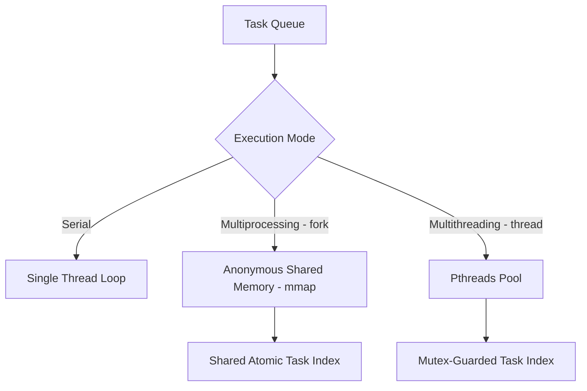

# Encryptoni — Complete User & Developer Guide

Welcome to the full guide for **Encryptoni**, a secure, high-performance parallel cryptographic file encryption engine built in C++17. 

This guide details everything you need to know to set up, build, execute, benchmark, and understand the internal architecture of Encryptoni.

---

## Table of Contents
1. [Prerequisites & System Setup](#1-prerequisites--system-setup)
2. [Compilation Guide](#2-compilation-guide)
3. [Configuration & Key Setup](#3-configuration--key-setup)
4. [Step-by-Step Execution Guide](#4-step-by-step-execution-guide)
5. [How Concurrency Modes Work](#5-how-concurrency-modes-work)
6. [Cryptographic Design & Headers](#6-cryptographic-design--headers)
7. [Verification & Tamper-Proof Testing](#7-verification--tamper-proof-testing)
8. [Codebase Architecture & Components](#8-codebase-architecture--components)
9. [Troubleshooting & FAQ](#9-troubleshooting--faq)

---

## 1. Prerequisites & System Setup

Encryptoni requires a C++17 compiler and **OpenSSL 3.x** for cryptographic primitives (AES-256-GCM and PBKDF2).

### macOS Installation (via Homebrew)
```bash
brew install openssl@3
```
*Note: The `Makefile` is pre-configured to detect the location of Homebrew's OpenSSL prefix automatically on Apple Silicon or Intel Macs.*

### Linux Installation (Ubuntu/Debian)
```bash
sudo apt-get update
sudo apt-get install build-essential libssl-dev
```

---

## 2. Compilation Guide

To build the project, navigate to the `encryptoni` subdirectory and run `make`:

```bash
cd encryptoni
make
```

This compiles two distinct executable targets:
* **`encrypt_decrypt`**: The main user-facing tool. It scans a directory recursively, prompts you for configuration parameters, and schedules the cryptographic tasks concurrently using your chosen mode.
* **`cryption`**: A lightweight standalone CLI utility. It takes a single serialized task representation (e.g. `file.txt,ENCRYPT`) and executes the process for that specific file.

To clean all compiled object files (`.o`) and executables:
```bash
make clean
```

---

## 3. Configuration & Key Setup

Encryptoni securely retrieves the master passphrase from a `.env` file loaded at runtime.

1. In the directory from which you run the binaries, create a file named `.env`:
   ```bash
   echo "my-super-secret-password-123!" > .env
   ```
2. **Security Feature**: The application automatically trims leading and trailing whitespaces, tabs, carriage returns, and newlines from this file content before executing key derivation, preventing common formatting typos.

---

## 4. Step-by-Step Execution Guide

### Scenario: Encrypting a Folder of Documents

Let's walk through an interactive run:

#### Step 1: Create a Test Directory with Sample Files
```bash
mkdir -p test_files
echo "Secret data A" > test_files/doc_a.txt
echo "Secret data B" > test_files/doc_b.txt
```

#### Step 2: Launch the Main Orchestrator
```bash
./encrypt_decrypt
```

#### Step 3: Respond to the Prompts
* **Enter the directory path**: `test_files`
* **Enter the action (encrypt/decrypt)**: `encrypt`
* **Enter the execution mode (serial/fork/thread)**: `fork`

```
Enter the directory path: test_files
Enter the action (encrypt/decrypt): encrypt
Enter the execution mode (serial/fork/thread): fork
Executing tasks via Multiprocessing (fork + shared memory)...
Spawning 8 worker processes...

Multiprocessing Execution Completed.
Successfully processed: 2 files.
Failed: 0 files.
```

#### Step 4: Verify the Files are Encrypted
If you view `test_files/doc_a.txt`, it will no longer display plaintext. Instead, it contains binary ciphertext starting with the 44-byte Encryptoni cryptographic header:
```bash
cat test_files/doc_a.txt
# Output will be binary garbage representing Salt + IV + GCM Auth Tag + Ciphertext
```

#### Step 5: Decrypt the Files Back
Run the orchestrator again:
```bash
./encrypt_decrypt
```
Provide the same directory path (`test_files`), type `decrypt` for the action, and pick your preferred mode. The files will be decrypted back to their original plaintexts.

---

## 5. How Concurrency Modes Work

Encryptoni offers three processing models depending on hardware capabilities:



### 1. Serial Mode
Processes tasks sequentially. Best for single-core machines, low workloads, or isolated debugging.

### 2. Multiprocessing Mode (`fork` + Shared Memory)
* Spawns worker processes using `fork()`.
* **State Coordination**: To track progress across separate address spaces, Encryptoni allocates a shared memory region via anonymous mapping (`mmap` with `MAP_SHARED | MAP_ANONYMOUS`).
* **Lock-Free Indexing**: The shared memory segment stores a `SharedState` struct holding `std::atomic<size_t>` and `std::atomic<int>` counters. Workers safely query and update task indices lock-free using atomic fetch-and-add operations.
* **Why it is faster**: Forked processes have independent virtual memory pages. This avoids thread-safety lock contention and prevents L2 cache bouncing, yielding maximum throughput on multicore systems.

### 3. Multithreading Mode (`pthread` Thread Pool)
* Spawns worker threads using `pthread_create`.
* **Synchronization**: Uses a traditional mutex lock (`pthread_mutex_t`) to guard the shared task index, ensuring no two threads process the same file.

---

## 6. Cryptographic Design & Headers

Encryptoni implements high-grade modern authenticated cryptography.

### Header Breakdown
Each encrypted file is written with a fixed **44-byte binary header**:

| Offset (Bytes) | Size (Bytes) | Component | Purpose |
|---|---|---|---|
| `0 - 15` | 16 | **Salt** | Randomized salt input for PBKDF2 to derive the AES key. |
| `16 - 27` | 12 | **IV** | Unique Initialization Vector for AES-256-GCM. |
| `28 - 43` | 16 | **Auth Tag** | GCM Authentication Tag verifying ciphertext integrity. |
| `44+` | Variable | **Ciphertext** | The encrypted payload. |

### Streaming I/O Pipeline
To remain highly memory-efficient, Encryptoni never loads files entirely into RAM. It streams inputs in **64KB chunks** via:
1. `EVP_EncryptUpdate` / `EVP_DecryptUpdate` loops.
2. An atomic swap architecture: 
   - Files are encrypted into temporary files: `.tmp_enc` (encryption) or `.tmp_dec` (decryption).
   - Once successfully completed (including integrity validation), standard `fs::rename` is called to replace the source file. If any error occurs, the temp file is deleted immediately, leaving the original file intact.

---

## 7. Verification & Tamper-Proof Testing

AES-GCM is an **Authenticated Encryption** scheme. This means decryption is not just about translating bytes; it verifies that the file was not altered.

### Testing Tamper Detection
You can test this integrity mechanism:
1. Encrypt a file:
   ```bash
   ./cryption "test_files/doc_a.txt,ENCRYPT"
   ```
2. Manually alter a single byte in the encrypted file (for example, change the 35th byte, which sits in the authentication tag block):
   ```bash
   # Modifies a single byte in the file
   printf '\xff' | dd of=test_files/doc_a.txt bs=1 seek=35 count=1 conv=notrunc 2>/dev/null
   ```
3. Attempt decryption:
   ```bash
   ./cryption "test_files/doc_a.txt,DECRYPT"
   ```
4. **Result**: OpenSSL's `EVP_DecryptFinal_ex` will detect the corrupted tag and reject decryption. The utility outputs:
   `Integrity verification failed for file: test_files/doc_a.txt (wrong key or corrupt data)`
   The corrupted output file is automatically deleted, preventing the user from reading unsafe, altered payloads.

---

## 8. Codebase Architecture & Components

* **[Cryption.cpp](file:///Users/abhoydas/Desktop/encryptoni-main/encryptoni/src/app/encryptDecrypt/Cryption.cpp)**: Contains the cryptographic core routines. It manages OpenSSL `EVP_CIPHER_CTX` structures, reads/writes headers, performs key derivation, and implements chunked streaming.
* **[ProcessManagement.cpp](file:///Users/abhoydas/Desktop/encryptoni-main/encryptoni/src/app/processes/ProcessManagement.cpp)**: Manages concurrent scheduling. Submits tasks, maps shared memory segments, forks processes, spawns threads, and manages join operations.
* **[Task.hpp](file:///Users/abhoydas/Desktop/encryptoni-main/encryptoni/src/app/processes/Task.hpp)**: Represents a serialized task. Serializes to/from string formats (e.g. `filepath,ACTION`) to pass tasks cleanly across IPC boundaries.
* **[ReadEnv.cpp](file:///Users/abhoydas/Desktop/encryptoni-main/encryptoni/src/app/fileHandling/ReadEnv.cpp)**: Houses the logic to load the `.env` configuration file containing the decryption key.
* **[main.cpp](file:///Users/abhoydas/Desktop/encryptoni-main/encryptoni/main.cpp)**: Entry CLI program that handles inputs and scans folders recursively for files.

---

## 9. Troubleshooting & FAQ

### Q: Why am I getting "OpenSSL headers not found" during compilation?
On macOS, standard system paths don't expose OpenSSL. The `Makefile` relies on Brew. If Homebrew is installed in a non-standard location, set the `OPENSSL_PREFIX` variable manually:
```bash
make OPENSSL_PREFIX=/path/to/openssl
```

### Q: Does it encrypt hidden files?
No. `main.cpp` is programmed to ignore hidden files (those starting with `.`), makefiles, temp files, and the output binaries (`encrypt_decrypt`, `cryption`).

### Q: What happens if the system shuts down mid-encryption?
Since Encryptoni uses temporary files (`.tmp_enc`/`.tmp_dec`) and performs an atomic rename at the very end, an interrupted process will leave the original file completely untouched. You will only need to clean up any orphaned `.tmp_enc` or `.tmp_dec` files.
